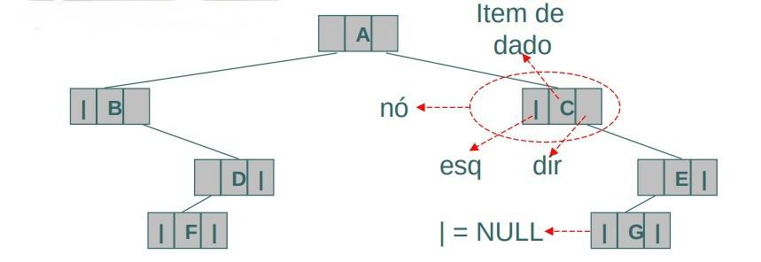
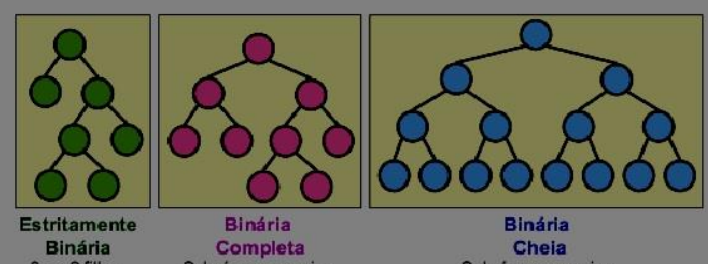

Árvores binárias consistem em um conjunto de nós que, ou está vazio, ou possui, no máximo, outros dois nós filhos derivados desses nós pais. As subárvores de cada um desses nós, são chamadas de subárvore direita e subárvore esquerda, sendo assim, se um nó pai possuir apenas um nó filho, esse nó filho deve ser definido como uma subárvore esquerda ou subárvore direita. Além disso, ela também pode ser vazia. A vantagem da árvore binária de busca é que, por ela estar ordenada, a pesquisa consiste em percorrer apenas uma subárvore até encontrar o elemento ou até atingir um nó folha da subárvore, o que deixa sua busca em ordem.

## Tipos de Árvores Binárias

- **Estritamente Binária**: cada nó tem 0 ou 2 filhos.
- **Binária Completa**: subárvores vazias no último ou penúltimo nível.
- **Binária Cheia**: subárvores vazias apenas no último nível.

## Percursos em Árvores Binárias

### Pré-Ordem (RED)

1. Visitar a raiz;
2. Percorrer subárvore esquerda;
3. Percorrer subárvore direita;

**Exemplo**: A, B, D, F, C, E, G

---

### In-Ordem (ERD) — ordem crescente

1. Percorrer subárvore esquerda;
2. Visitar a raiz;
3. Percorrer subárvore direita;

**Exemplo**: F, D, B, A, G, E, C

---

### Pós-Ordem (EDR) — forma polonesa

1. Percorrer subárvore esquerda;
2. Percorrer subárvore direita;
3. Visitar a raiz;

**Exemplo**: F, D, B, G, E, C, A
