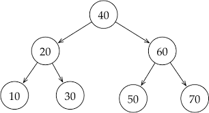

A Árvore Binária de Busca (ABB) é uma estrutura que permite organizar dados de forma hierárquica e ordenada. Ela segue a seguinte regra:

- Os valores menores que o do nó atual vão para a esquerda
- Os valores maiores vão para a direita

Com isso, é possível buscar, inserir ou remover valores com mais eficiência do que listas ou arrays. Se bem balanceada, ela permite operações com complexidade O(log n).

Essa estrutura é usada em sistemas que precisam de pesquisa rápida, como banco de dados, sistemas de arquivos e dicionários.

Na imagem acima, temos um exemplo de árvore binária de busca. Esse tipo de estrutura segue o mesmo raciocínio da busca binária, o que facilita bastante quando a gente precisa procurar, inserir ou remover algum valor. A ideia é simples: a cada passo, a gente vai pra esquerda ou pra direita, sempre descartando metade da árvore. Isso deixa tudo mais rápido.

Por exemplo: se eu estiver procurando o número 30, começo lá no topo, que é o nó-raiz (40). Como 30 é menor que 40, vou pro lado esquerdo, onde tá o 20. Aí comparo de novo: 30 é maior que 20, então sigo pro lado direito do 20... e pronto, achei o 30, sem nem precisar olhar o outro lado da árvore. Outra coisa legal dessa estrutura é que, por causa da ordem natural dela, o menor valor sempre vai estar mais à esquerda, e o maior, mais à direita. Olhando a imagem, dá pra ver isso fácil: o 10 é o menor (folha mais à esquerda) e o 70 é o maior (folha mais à direita).