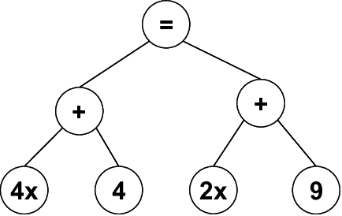

As árvores de expressão são um tipo especial de árvore binária onde os nós internos são operadores matemáticos (+, -, *, /) e os nós folhas são operandos, como números ou variáveis.

São amplamente utilizadas em linguagens de programação para avaliar expressões matemáticas complexas, uma vez que a ordem das operações fica organizada naturalmente em sua estrutura.

Exemplo de árvore de expressão para a equação "4x+4=2x+9":

