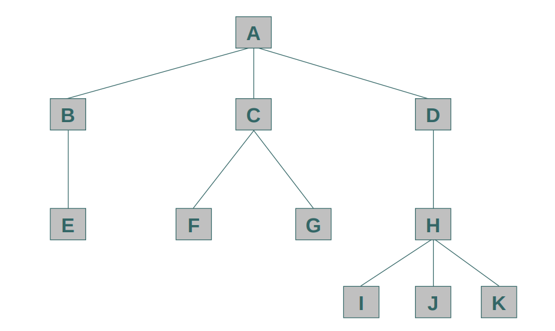

Árvores são estruturas de dados que caracterizam uma relação entre os dados que a compõem. A relação existente entre os dados (nós) de uma árvore, é uma relação de hierarquia. Uma árvore é um conjunto finito T de um ou mais nós. Algumas características das árvores em estruturas de dados incluem: uma árvore possui um nó chamado de raiz da árvore e os demais nós ligados por linhas são denominados subárvores.

Representação esquemática de uma árvore:

## Terminologia

- **Raiz**: o nó principal da árvore (ex: nó A).
- **Subárvore**: qualquer nó é raiz de uma subárvore.
- **Grau** de um nó: quantidade de subárvores diretas (ex: nó C tem grau 2 — F e G).
- **Nó folha ou terminal**: nó sem subárvores derivadas (ex: nó E).
- **Nível**: quantidade de nós entre ele e a raiz (ex: nó J está no nível 3).
- **Pai e filhos**: nó acima é o pai; nós abaixo são filhos.
- **Irmãos**: nós com o mesmo pai (ex: I, J e K).
- **Chave**: valor usado para identificar um item.
