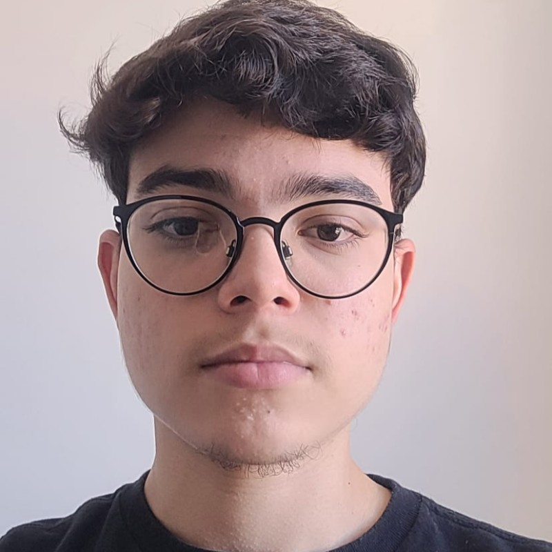
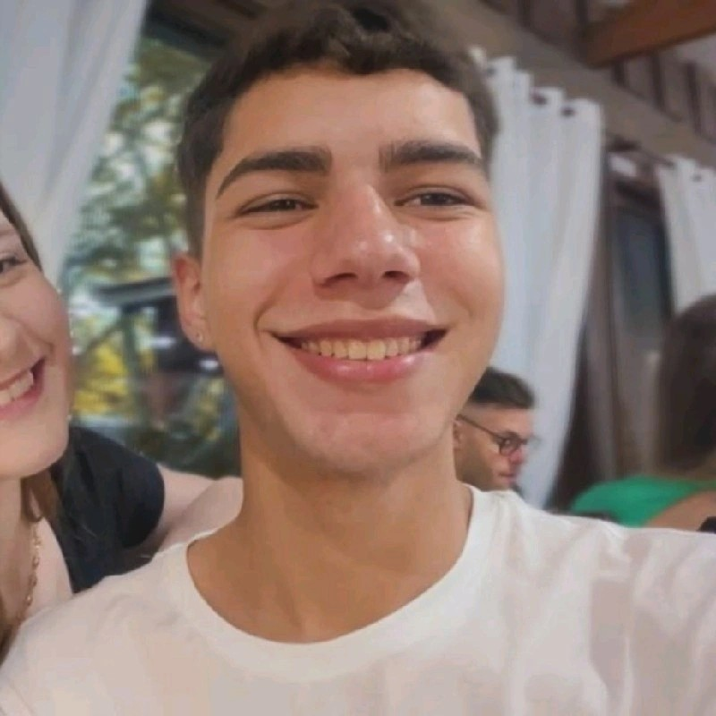

# Créditos

Essa WebQuest foi desenvolvida por um grupo de estudantes do curso de Bacharelado em Sistema de Informação do Instituto Federal Catarinense Campus Araquari, como parte de uma atividade acadêmica. A seguir, apresentamos os participantes:

  
  
<strong>Gustavo Kubiack</strong> Estudante 
    <a href="https://www.linkedin.com/in/gustavokubiack/" target="_blank">LinkedIn</a>
  

  
  
<strong>Luiz Mário</strong> Estudante 
    <a href="https://www.linkedin.com/in/luiz-mario-fontes-da-silva-filho/" target="_blank">LinkedIn</a>
  

  
  
<strong>Rafael Serrano</strong> Estudante 
    <a href="https://www.linkedin.com/in/rafael-serrano-029310272" target="_blank">LinkedIn</a>
  

  
  
<strong>Sidnei Barcelos</strong> Estudante 
    <a href="https://br.linkedin.com/in/sidnei-barcelos-72281b218" target="_blank">LinkedIn</a>
  

