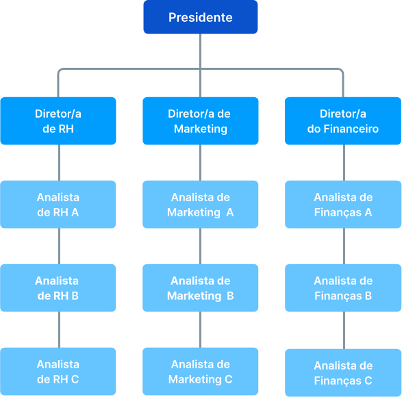

Árvores são estruturas de dados que caracterizam uma relação entre os dados que a compõem. A relação existente entre os dados (nós) de uma árvore, é uma relação de hierarquia. Uma árvore é um conjunto finito T de um ou mais nós. Algumas características das árvores em estruturas de dados incluem: uma árvore possui um nó chamado de raiz da árvore e os demais nós ligados por linhas são denominados subárvores.

- Representação esquemática de uma árvore:

    

- Representação esquemática de uma empresa em forma de árvore:

    
